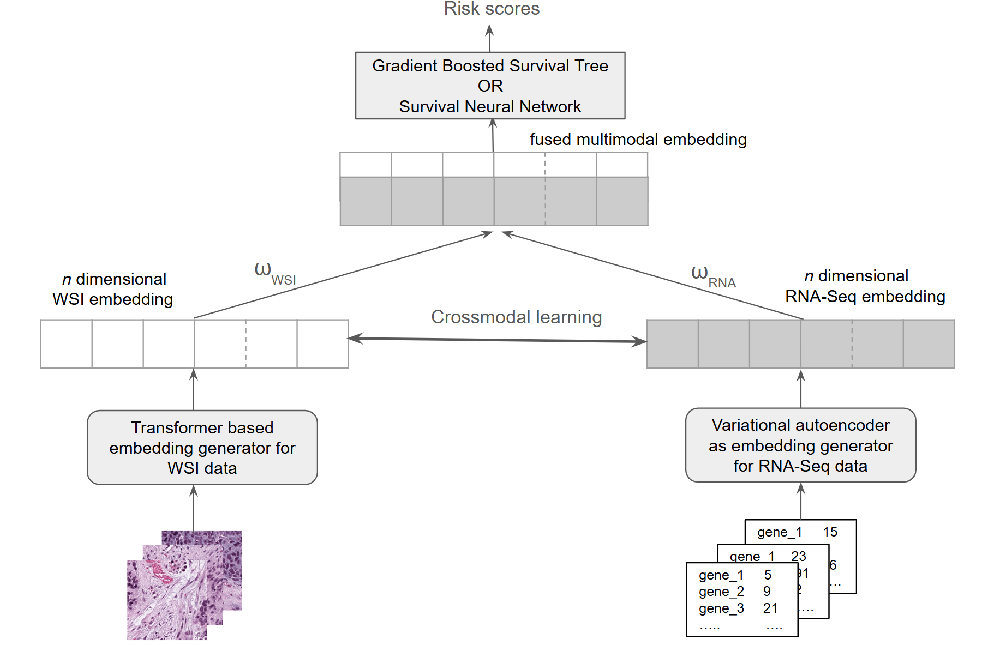

# Multimodal data fusion strategies for LUCID thrust 1
Code for multimodal model training using multiple data fusion 
techniques for LUCID (Low-dose Understanding, Cellular Insights, 
and Molecular Discoveries). 
Even though LUCID specifically focuses on low dose settings, 
in the absence of clean LDR-induced cancer specific datasets 
(that should be made available shortly), 
we are using comparable datasets from the public TCGA database. 

<!--
## Table of content

- [Task](#task)
- [Data used](#data-used)
- [Training methodology](#training-methodology)
- [Running the code](#running-the-code)
- [Code structure](#code-structure)
- 

## Task
-->
The objective is to develop a deep learning framework to 
predict cancer related times to events using matched 
multimodal samples. Currently, we are using 
whole slide image (WSI) and tabular gene expression (bulk RNASeq)
data from the lung adenocarcinoma samples from the TCGA database 
(TCGA-LUAD). 
The code is being developed in a modular framework so that 
it can be easily extended to handle more input data modalities
when needed. 

<!--
## Data used:

1. Histology data [Whole Slide Images (WSI)] <br />


2. Tabular gene expression (bulk RNA-seq) data <br />

[//]: # (These data have been collected from https://drive.google.com/drive/folders/14TwYYsBeAnJ8ljkvU5YbIHHvFPltUVDr)
-->

## Training methodology
Embeddings are generated from the histology whole slide images and 
the tabular gene expression data that are fused to be used as 
input for a downstream task specific model that 
uses the Cox-PH partial likelihood loss function, to predict the risk scores for patients.

Embeddings from the RNASeq and WSI modalities are learnt and combined using these two strategies: 
1. Simple Fusion
   - The embedding generation strategies for the two modalities are independent of each other and the downstream task.
   - The embeddings are generated separately and their weighted summation is used as inputs to a downstream task-specific (survival) model.
   - Simpler to train due to a relatively low number of trainable parameters.

2. Crossmodal Fusion
    - Embeddings from the individual modalities are generated in a crossmodal manner (using a contrastive loss function) where they are informed about the other modality, leading to a stronger inter-modal coupling 
    - The crossmodality aware embeddings are combined using weighted summation and passed as inputs to a downstream task-specific (survival) model
    - More computationally expensive to train, and more prone to overfitting for small datasets.


<!--
In the joint fusion approach, all the models are trained 
simultaneously using the loss function.
We are also exploring other methods for embedding generation, 
including attention based encoder models.
-->

**Generation of the WSI embeddings**

The original WSIs are too large to be used with standard 
CNN/transformer based models. 
Hence, they are split into smaller non-overlapping tiles 
(of 224 x 224 pixel resolution) that are fed to a 
[pretrained histology foundation model](https://huggingface.co/MahmoodLab/UNI) 
that generates 1024 dimensional embedding. It is a transformer based foundation model developed for computational pathology. It employs a Vision Transformer (ViT) Large (ViT-L) architecture and was pretrained on the Mass-100K dataset, a large-scale histopathology dataset comprising over 100 million tissue patches from more than 100,000 diagnostic WSIs across 20 major tissue types. This dataset includes histology slides collected from Massachusetts General Hospital (MGH), Brigham and Women's Hospital (BWH), and the Genotype-Tissue Expression (GTEx) consortium, with additional training on external datasets such as TCGA used for evaluation but not directly included in pretraining. (note that we use the version 1 of the UNI model to prevent data leakage when using TCGA datasets; the version 2 of UNI was trained using the TCGA datasets).

Patch level embeddings are averaged to obtain WSI level 
embeddings.
<!-- For early fusion, patch level embeddings are generated 
keeping the FM entirely frozen.
For joint fusion, the last transformer block of the FM is unfrozen and trained together with the bulk RNASeq embedding generator -->

**Embedding generation from the gene expression data**

The original gene expression count data, owing to its very high dimensionality (≈ 20K) is not suitable for directly being
ingested by a neural network. We generate lower dimensional embeddings for the gene expression data from the latent space
of a variational autoencoder (VAE) trained to generate 
256-dimensional embeddings of the ~20K dimensional gene 
expression data.
<!-- For early fusion, the VAE is trained on 70% of the samples 
(training set), and embeddings generated from the trained model 
are used for test set predictions on the remaining samples.
For joint fusion, the VAE is trained simultaneously with 
a portion of the WSI foundation model to generate embeddings 
that are informed by the survival prediction task -->

<!-- **Learning from multimodal embeddings** 

Simple Fusion:
- Gradient boosted model (GBM) [with decision trees as base learners] with Cox partial likelihood loss
- GBM outperforms neural networks (NN) for relatively small number of training samples


Crossmodal Fusion:
- NN with Cox partial likelihood loss
- NNs allow backpropagation of task-specific loss to the inputs that allow 
updation of the embeddings from the two modalities in the learning process
calculation of explainability metrics.  -->

A schematic of the multimodal framework is shown below:




**Loss function and model training**

The Cox proportional hazards model is used to relate survival time 
(or time to death for the uncensored events) with the predictor variables (covariates). 
The model assumes that the hazard function (the instantaneous rate of occurrence of the event) 
for any individual can be expressed as the product of an unknown baseline hazard function 
and an exponential function of linear combinations of predictor variables.

The goal of survival prediction model is to predict the 
likelihood that a patient $i$ will survive till a certain time $t$, for a set of covariates
$\boldsymbol{X_i}$ ($\boldsymbol{X}$ is written in bold to clarify that it is a vector, 
and the subscript $i$ is for the patient ID). 
The hazard function $h(t|\boldsymbol{X_i})$ is defined as:

$$h(t|\boldsymbol{X_i}) = h_0(t) e^{\boldsymbol{\beta}^\top \boldsymbol{X_i}} $$

  where $h_0$ is the baseline hazard function, and $\boldsymbol{\beta}$ is the vector of coefficients for the covariates, that is assumed to be the same for all patients.

***Survival Neural Network (SNN)***: To calculate the model parameters $\boldsymbol{\beta}$, the negative log likelihood (NLL) of $h(t|\boldsymbol{X_i})$ is minimized:

$$L(\boldsymbol{\beta}) = \sum_{i \in E} \left[ \boldsymbol{\beta}^\top \boldsymbol{X_i} - \log \left( \sum_{j \in \Omega_i} \exp(\boldsymbol{\beta}^\top \boldsymbol{X}_j) \right) \right], $$

  where the outer summation is done over the set of individuals for whom the event of interest (for this case, death) has been observed, and the inner summation is over all individuals in the risk set $\Omega_i$ at the time of event for individual $i$.

The model, using the fused embeddings as the input, is allowed to predict $\boldsymbol{\beta}^\top \boldsymbol{X_i}$, i.e., the log risk of the event for individual $i$ based on their covariates. In the loss function, this output is denoted by $f_\theta(\boldsymbol{X_i})$:

$$L(\boldsymbol{\theta}) = \sum_{i \in E} \left[ f_\theta(\boldsymbol{X_i}) - \log \left( \sum_{j \in \Omega_i} \exp(f_\theta(\boldsymbol{X_j})) \right) \right] $$

***Gradient Boosted Survival Tree (GBST)***: Unlike standard Cox regression, which directly estimates the coefficients ($\beta$), GBST learns a flexible, nonlinear function that improves over successive iterations using the boosting strategy. At each step, the model calculates the gradient of the log partial likelihood and fits a regression tree (that uses the mean squared error with improvement score by Friedman to measure the quality of a split) to minimize residual errors.  

<!--
The Cox proportional hazards model is used to relate survival time (or time to death for the uncensored events) with the predictor variables (covariates). The model assumes that the hazard function (the instantaneous rate of occurrence of the event) for any individual can be expressed as the product of an unknown baseline hazard function and an exponential function of linear combinations of predictor variables.
    - The goal of survival prediction model is to predict the likelihood that a patient $i$ will survive till a certain time $t$, for a set of covariates $\boldsymbol{X_i}$ ($X$ is written in bold to clarify that it is a vector, and the subscript $i$ is for the patient ID). The hazard function $h(t|\boldsymbol{X_i})$ is defined as $h(t|X_i) = h_0(t)e^{\boldsymbol{\beta}^\top \boldsymbol{X_i}}$ 
where $h_0$ is the baseline hazard function, and $\boldsymbol{\beta}$ is the vector of coefficients for the covariates, that is assumed to be the same for all patients. 
To calculate the model parameters 
$\boldsymbol{\beta}$, the negative log likelihood (NLL) of $h(t|\boldsymbol{X_i})$ is minimized in Cox regression 
$L(\mathbf{\beta}) = \sum_{i \in E} \left[ \mathbf{\beta}^\top \mathbf{X_i} - \log \left( \sum_{j \in \Omega_i} \exp(\mathbf{\beta}^\top \mathbf{X}_j) \right) \right]$, 
where the outer summation is done over the set of individuals for whom the event of interest (for this case, death) has been observed, and the inner summation is over all individuals in the risk set $\Omega_i$ at the time of event for individual $i$.
    - The output of the downstream model (that uses the fused embeddings as the input) is allowed to predict $\boldsymbol{\beta}^\top \boldsymbol{X_i}$, i.e., the log risk of the event for individual $i$ based on their covariates. In Eq \ref{eq:loss_function}, this output is denoted by $f_\theta(\boldsymbol{X_i})$ in the loss function
      $$L(\boldsymbol{\theta}) = \sum_{i \in E} \left[ f_\theta(\boldsymbol{X_i}) - \log \left( \sum_{j \in \Omega_i} \exp(f_\theta(\boldsymbol{X_j})) \right) \right]$$
-->

## Running the code
<!--
``` sh
python trainer.py --input_path --input_wsi_path --batch_size --lr --lr_decay_iters --num_epochs --gpu_ids --input_size_wsi --embedding_dim_wsi --embedding_dim_omic --input_modes --fusion_type --profile --use_mixed_precision --use_gradient_accumulation

```
-->

<!-- | Input Arguments      | Explanation                                             | Type and Default Value                                                               |
|----------------------|---------------------------------------------------------|--------------------------------------------------------------------------------------|
| --input_path         | Path to input data files                               | type=str, default='/mnt/c/Users/tnandi/Downloads/multimodal_lucid/multimodal_lucid/preprocessing/' |
| --input_wsi_path     | Path to input WSI tiles                                | type=str, default='/mnt/c/Users/tnandi/Downloads/multimodal_lucid/multimodal_lucid/preprocessing/TCGA_WSI/batch_corrected/processed_svs/tiles/256px_9.9x/combined_tiles/' |
| --batch_size         | Batch size for training                                | type=int, default=4                                                                   |
| --lr                 | Learning rate                                          | type=float, default=0.001                                                             |
| --lr_decay_iters     | Learning rate decay steps                              | type=int, default=100                                                                 |
| --num_epochs         | Number of training epochs                              | type=int, default=2                                                                   |
| --gpu_ids            | gpu ids: e.g. 0  0,1,2, 0,2. use -1 for CPU            | type=str, default='0'                                                                 |
| --input_size_wsi     | input_size for path images                             | type=int, default=256                                                                 |
| --embedding_dim_wsi  | embedding dimension for WSI                            | type=int, default=128                                                                 |
| --embedding_dim_omic | embedding dimension for omic                           | type=int, default=256                                                                 |
| --input_modes        | wsi, omic, wsi_omic                                    | type=str, default="wsi"                                                               |
| --fusion_type        | early, late, joint, unimodal                           | type=str, default="unimodal"                                                          |
| --profile            | whether to profile or not                              | type=str, default=False                                                               |
| --use_mixed_precision| whether to use mixed precision calculations            | type=str, default=False                                                               |
| --use_gradient_accumulation | whether to use gradient accumulation               | type=str, default=False                                                               | -->


| Input Arguments            | Explanation                                                         | Type and Default Value                            |
|----------------------------|---------------------------------------------------------------------|--------------------------------------------------|
| --check_PH_assumptions     | Check proportional hazards assumptions                            | type=store_true                                  |
| --plot_embs                | Plot embeddings                                                   | type=store_true                                  |
| --plot_survival            | Plot survival curves                                              | type=store_true                                  |
| --drop_outliers            | Drop very high values of survival duration in the data           | type=store_true                                  |
| --do_bootstrap             | Perform bootstrap resampling on test data                        | type=store_true, default=True                    |
| --do_hpo                   | Perform hyperparameter optimization    | type=store_true                                  |
| --apply_pca                | Apply PCA dimensionality reduction                               | type=store_true                                  |
| --use_model                | Model type: gradient boosted survival tree (gbst) or survival neural network (snn) | type=str, default='gbst', choices=['snn', 'gbst'] |
| --mode                     | Data modality to use                                             | type=str, default='rnaseq_wsi', choices=['rnaseq_wsi', 'only_rnaseq', 'only_wsi'] |


<!--
## Code structure:

1. [joint-fusion/trainer.py](https://github.com/DOE-LUCID/multimodal_learning_T1/blob/main/joint_fusion/trainer.py): The driver code that uses the WSI (tile level) and gene expression mapping information to call the function that carries out the model training
2. [joint-fusion/train_test.py](https://github.com/DOE-LUCID/multimodal_learning_T1/blob/main/joint_fusion/train_test.py): Carries out the multimodal model training over a specified number of epochs using a training dataloader created from the dataframe containing the  WSI and gene expression mapping information. Also contains the loss function implementation.
3. [joint-fusion/models.py](https://github.com/DOE-LUCID/multimodal_learning_T1/blob/main/joint_fusion/models.py): Contains the implementation of the multimodal model class.
4. [joint-fusion/create_image_molecular_mapping.py](https://github.com/DOE-LUCID/multimodal_learning_T1/blob/main/joint_fusion/create_image_molecular_mapping.py): Creates a file/dataframe containing matched WSI, gene expression, and clinical data for the TCGA samples.
5. [joint-fusion/generate_rnaseq_embeddings.py](https://github.com/DOE-LUCID/multimodal_learning_T1/blob/main/joint_fusion/generate_rnaseq_embeddings.py): Generates RNASeq embeddings using a VAE. The VAE can be trained using this script directly, or the trained VAE can be used to generate embeddings for new samples.
6. [joint-fusion/generate_wsi_embeddings.py](https://github.com/DOE-LUCID/multimodal_learning_T1/blob/main/joint_fusion/generate_wsi_embeddings.py): Generates WSI embeddings using a pretrained histology foundation model. Separate networks will be implemented later that can be trained over local data. 
7. [early_fusion_poc.py](https://github.com/DOE-LUCID/multimodal_learning_T1/blob/main/early_fusion_poc.py): Code for carrying out training of a GBM with the Cox-PH partial likelihood as the loss function. It uses early fusion using existing embeddings generated for the two modalities.

## Relevant input files:

1. mapping_df.json : Dictionary containing 'days_to_death', 'days_to_last_followup', 'event_occurred' (dead/alive), WSI tiles, the RNASeq data, and 'time' ('days_to_death' for ). Created using [joint-fusion/trainer.py](https://github.com/DOE-LUCID/multimodal_learning_T1/blob/main/joint_fusion/trainer.py) from the mapping file generated by [joint-fusion/create_image_molecular_mapping.py](https://github.com/DOE-LUCID/multimodal_learning_T1/blob/main/joint_fusion/create_image_molecular_mapping.py)
2. rnaseq_df.json
3. 
--> 

## Steps for obtaining survival predictions using early fusion 
### Dataset creation
1. Use slideflow to create 256x256 tiles from the WSIs. Use [preprocessing/slideflow_preprocessing.py](https://github.com/DOE-LUCID/multimodal_learning_T1/tree/main/preprocessing/slideflow_preprocessing.py) 
<!-- [To create consistent number of samples from the hand-cleaned tiles from the WSIs with pen marks, use [subsample_tiles.py](https://github.com/DOE-LUCID/multimodal_learning_T1/blob/main/preprocessing/subsample_tiles.py)] --> 
2. Create a json file ('mapped_data_*.json') containing the TCGA ID, the corresponding TCGA WSI tile names, RNASeq data, and clinical data (dead/alive, time to death/time to last followup) using [preprocessing/create_image_molecular_mapping.py](https://github.com/DOE-LUCID/multimodal_learning_T1/blob/main/preprocessing/create_image_molecular_mapping.py)
3. Clean up the above json file to retain only the samples of interest, and create a h5 file containing the mapping information using [trainer.py]()
### Embedding generation for histology and bulk rnaseq modalities
4. Generate slide level embeddings from the WSIs using a pretrained pathology foundation model [joint-fusion/generate_wsi_embeddings.py](https://github.com/DOE-LUCID/multimodal_learning_T1/blob/main/joint_fusion/generate_wsi_embeddings.py)
5. Train a VAE using [joint-fusion/generate_rnaseq_embeddings_kfoldCV_hpo.py](https://github.com/DOE-LUCID/multimodal_learning_T1/blob/main/joint_fusion/generate_rnaseq_embeddings_kfoldCV_hpo.py) setting 'training=True'
6. Generate RNASeq embeddings using [joint-fusion/generate_rnaseq_embeddings_kfoldCV_hpo.inference.py](https://github.com/DOE-LUCID/multimodal_learning_T1/blob/main/joint_fusion/generate_rnaseq_embeddings_kfoldCV_hpo.inference.py) setting 'inference=True'
<!--5. Create file containing the clinical data ('days_to_death', 'days_to_last_followup', 'vital_status' (dead/alive)) from the TCGA bcr xml files (combined_clinical_TCGA-LUAD.csv using [preprocessing/create_combined_clinical_parallel.py](https://github.com/DOE-LUCID/multimodal_learning_T1/blob/main/preprocessing/create_combined_clinical_parallel.py) -->
### Train model for survival prediction, and obtain predictions for the test set 
<!-- using gradient boosted survival tree (preferred over NNs for relatively small number of training samples) -->
8. Run [early_fusion_slide_level_risk_scores.py](https://github.com/DOE-LUCID/multimodal_learning_T1/blob/main/early_fusion/early_fusion_slide_level_risk_scores.py) for Simple Fusion, or Run [early_fusion_crossmodal.py](https://github.com/DOE-LUCID/multimodal_learning_T1/blob/main/early_fusion/early_fusion_crossmodal.py) for Crossmodal Fusion.


<!-- ## Steps for obtaining survival predictions using joint fusion 

1. Execute the steps listed for dataset creation in the previous section
2. Run [joint_fusion/trainer.py](https://github.com/DOE-LUCID/multimodal_learning_T1/blob/main/joint_fusion/trainer.py) for training
2. Run [joint_fusion/train_test.py](https://github.com/DOE-LUCID/multimodal_learning_T1/blob/main/joint_fusion/train_test.py) for inference and XAI metrics -->
